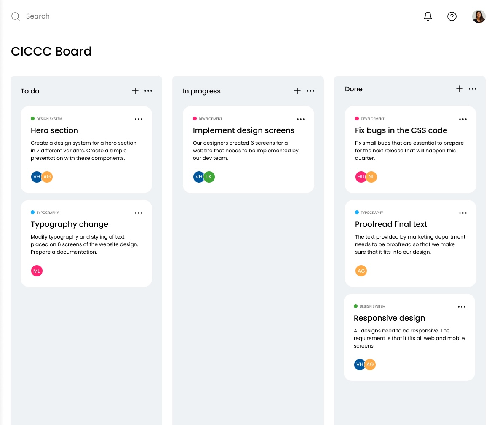

# OOP and TS - Final Project

**Objective:** Create a simple Kanban board web app with drag-and-drop functionality using HTML, CSS, TypeScript with classes. You will use everything you've learned so far in our program.

## Instructions 📖

1. Clone the repository to your local machine.
2. Decide as a team how you will build your web app. Since you are working as a team, you can use [**Astro**](https://astro.build/) so that it is easier for you to collaborate and keep everything modularized with components.
3. Set up a GitHub Project and assign different tasks to your teammates.
4. Design your Kanban board in Figma. I added an `example.jpg` image as a reference.
5. Develop your web app.

## Requirements ✅

- Use classes, fields, and methods for the different functionalities of your app.
For example:

  - `class TaskList {}` - To create a new instance of tasks
  - `this.tasks = []` - Store your tasks in a list
  - `add(newTask)` - Creates a new task
  - `update(id)` - Updates a task
  - `delete(id)` - Removes a task
  - `onDrag(element)` - Drag a task to a different column
  - `onDrop(element, targetColumn)` - Drop a task on a different column

  You also need to create a separate class for initializing your Kanban board.
- Drag-and-drop functionality - Check out the [Drag and Drop API](https://www.w3schools.com/html/html5_draganddrop.asp)! No need to use an external library.
- At least 3 columns: *To do*, *In progress*, *Done*. You can add more if you like.
- Modals:
  - View Task
  - Add Task
  - Edit Task
  - Delete Confirmation
- Search task name with auto-completion. When I type "CSS" on the search bar, it should automatically list all tasks related to "CSS". Clicking on a task will open the View Task modal
- Mobile-friendly (responsive)

### Additional Features ⚙️

These are **optional** but if you wish to add more functionality to your Kanban board, here are some features you can integrate:

- Add, Edit, Delete User
- Assign task to one or more users
- Add, Edit, Delete Columns
- Marking task as complete will automatically move it to the *Done* column
- Sort each column by task due date with a button click

## Presentation 📽️

Each team will have 10-15 minutes to present their web app. In addition to your Kanban board, you can present your mockup design, GitHub Project, challenges you faced, and what you have learned.

Good luck! :)
